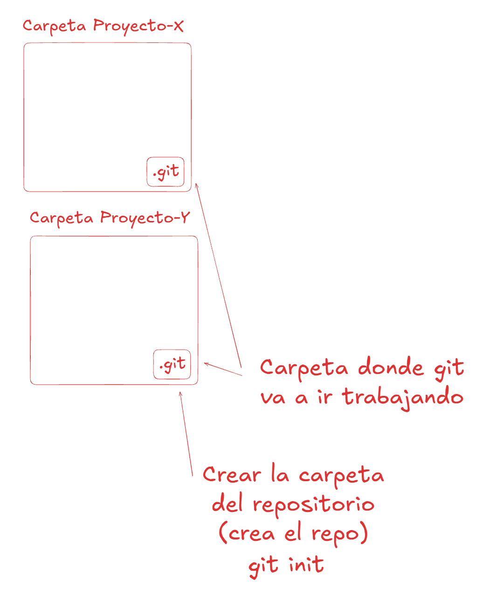
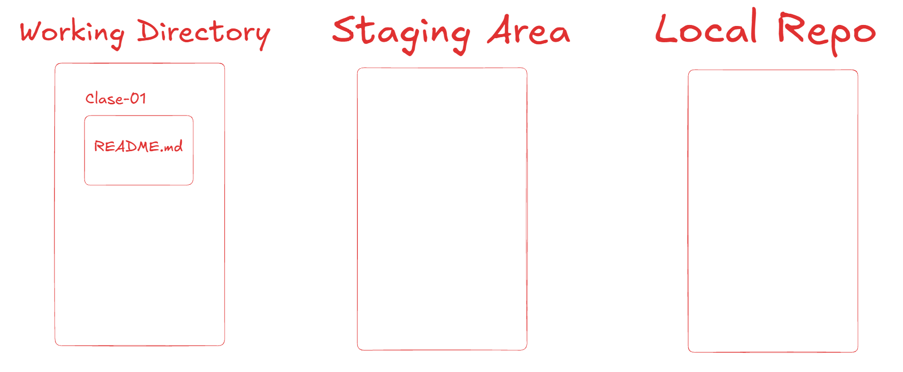

# Git Desarrollo Colaborativo

## Markdown
Lenguaje de etiquetado para tomar apuntes, anotaciones y dar instrucciones sobre el proyecto.

## Verificar que tenga instalado GIT

```sh
git --version
```

## Inicializo un repositorio de git

```sh
git init # crea la carpeta .git dentro del directorio/carpeta actual
```



## Configuracion inicial de GIT

```sh
git config --global user.name "Maximiliano Principe"  
git config --global user.email "mleducacion@gmail.com" 
```

## Verificar que la configuracion se hizo

```sh
git config --get-regexp user
```

## Como remover algo que no deseo que este

```sh
git config --global --unset user.mail
```

## Cambiar el editor a nano

```sh
git config --global core.editor nano
```

## Cambiar el nombre por defecto de la rama principal

```sh
git config --global init.defaultBranch main
```

## Ver las configuraciones hechas en un editor 

```sh
git config --global -e
```

## Ver el estado de los archivos del proyecto

```sh
git status
```

## Estados de los archivos

* Untracked (Sin seguimiento) => archivos que no se agregaron al index/stage y por consecuente no se les da seguimiento.
* Staged => Archivos que fueron agregados al index/stage area y cuyos cambios van a ser incorporados al repositorio
* Unmodified => Archivos que se cuentran en en el respositorio y no fueron modificado (Con respecto al repositorio)
* Modified => Archivos que se encuentro en el repositorio pero difieren con lo que se encuentra actualmente en el directorio trabajo (Working directory)


## Areas posibles en las que pueden estar los archivos

* Working Directory (Directorio de trabajo) donde van agregando, borrando los archivos del proyecto durante el desarrolllo

* Staging Area (Area de control de cambios) Se agregan los archivos para darle seguimiento y posteriormente sacarles una foto (commit)

* Local Repo (Area de validación de cambios, donde se registran las modificaciones realizadas) Donde van a estar todas las fotos (commit) que vaya sacando.

