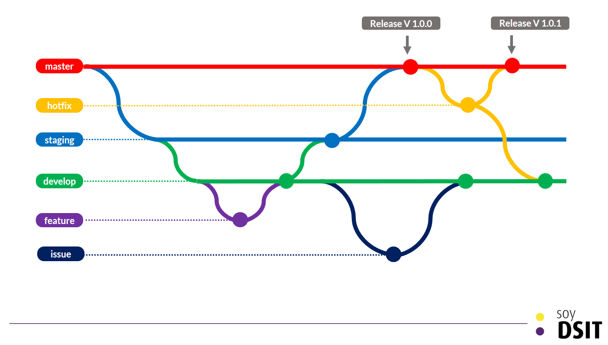

# Clase 03 - Git Desarrollo Colaborativo

## .gitignore
Me permite ignorar archivos o carpetas que quiero que no sean parte del repositorio.

## .gitkeep
Son archivos que permiten que las carpetas vacías puedan ser parte de un repositorio de git.

<https://www.campusmvp.es/recursos/post/que-son-los-archivos-gitkeep-en-git.aspx>

## Ramas (Branches)

### Workflow Reducido


### Workflow Ampliado



### Listar ramas

```sh
git branch 
```

### Crear una rama

```sh
git branch <nombre-rama>
git branch feature/branches
```

## Cambiar entre ramas

```sh
git switch <nombre-ramas>
git switch feature/branches
```

## Crear una rama y moverme a esa rama

```sh
git switch -c feature/branches-bis
```

## Fusiones (Merge)
Me permite fusionar ramas entre si. Logrando así obtener los commit de una rama en otra.

### Hay 3 tipos de funsiones

* fast-forward - Automaticas
* Triple vía (Cuando utiliza alguno de los algoritmos/estrategias) - Automaticas
* La fusión con conflicto - Manual 

### Mostrar diferencias entre ramas

```sh
git diff <rama-que-quiero-comparar> # Compara la rama actual contra la rama que indique
git diff <rama-uno> <rama-dos> # No importa en que rama este parado.
```

## Borrando una rama

```sh
git branch -d <nombre-rama> # Si el contenido de la rama que quiero borrar no fue fusionado con otra rama me va a pedir confirmación
git branch -D <nombre-rama> # Fuerzo el borrado de la rama, aunque el contenido lo pierda.
```

## Como subir una rama al remoto

```sh
git push origin <nombre-rama>
git push origin feature/branches
```


